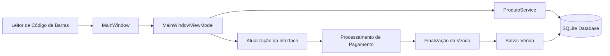

# 🛒 MeuCaixa PDV

> Sistema de Ponto de Venda (PDV) moderno para minimercados, desenvolvido com **C# + Avalonia UI**, com suporte multiplataforma para **Linux** e **Windows**.

[](LICENSE)
[](https://dotnet.microsoft.com/)
[](https://avaloniaui.net/)
[](https://www.sqlite.org/)

---

# ✨ Funcionalidades

## 🏪 Caixa (PDV)

- ✅ Leitura de código de barras via teclado ou leitor USB
- ✅ Adição automática de produtos
- ✅ Atualização dinâmica de subtotal e total
- ✅ Controle de quantidade por item
- ✅ Remoção rápida de produtos da venda
- ✅ Interface otimizada para touchscreen

---

## 💳 Pagamentos

- ✅ Pagamento em dinheiro com cálculo automático de troco
- ✅ Suporte a PIX *(integração futura via API)*
- ✅ Cartão de débito e crédito
- ✅ Fluxo rápido e intuitivo para atendimento

---

## 📦 Gerenciamento de Produtos

- ✅ Cadastro de produtos
- ✅ Edição de produtos existentes
- ✅ Busca por nome ou código de barras
- ✅ Controle de estoque
- ✅ Listagem completa de produtos

---

## 💾 Banco de Dados

- ✅ SQLite embarcado
- ✅ Sem necessidade de servidor externo
- ✅ Persistência automática de vendas e produtos
- ✅ Entity Framework Core

---

## 🎨 Interface

- ✅ Design moderno
- ✅ Layout responsivo
- ✅ Visual limpo e intuitivo
- ✅ Compatível com tablets e monitores touchscreen

---

# 🚀 Tecnologias Utilizadas

| Tecnologia | Versão | Função |
|---|---|---|
| .NET | 8.0 | Framework principal |
| C# | 12 | Linguagem principal |
| Avalonia UI | 11 | Interface gráfica multiplataforma |
| SQLite | 3 | Banco de dados local |
| Entity Framework Core | 8 | ORM e persistência |

---

# 📋 Pré-requisitos

Antes de começar, você precisa ter instalado:

- Linux *(Ubuntu/Debian recomendado)* ou Windows 10/11
- .NET SDK 8.0+
- Leitor de código de barras *(opcional)*
- Impressora térmica *(opcional)*

---

# 🔧 Instalação

## 1️⃣ Clone o repositório

```bash
git clone https://github.com/seu-usuario/MeuCaixa.git
cd MeuCaixa
````

---

## 2️⃣ Instale o .NET 8 (Linux)

```bash
sudo apt update
sudo apt install dotnet-sdk-8.0
```

No Windows, faça o download pelo site oficial:

👉 [https://dotnet.microsoft.com/download](https://dotnet.microsoft.com/download)

---

## 3️⃣ Restaure as dependências

```bash
dotnet restore
```

---

## 4️⃣ Compile o projeto

```bash
dotnet build
```

---

## 5️⃣ Execute o sistema

```bash
dotnet run
```

---

# 📦 Publicação

## Linux

```bash
dotnet publish -c Release -r linux-x64 --self-contained true -o ./publish
```

## Windows

```bash
dotnet publish -c Release -r win-x64 --self-contained true -o ./publish
```

---

# 🎮 Como Usar

## 🛍️ Fluxo de Venda

### Adicionar produtos

1. Digite ou escaneie o código de barras
2. Pressione `ENTER`
3. O item será adicionado automaticamente

---

### Remover produtos

* Clique no botão `✕` ao lado do item

---

### Finalizar venda

Escolha a forma de pagamento:

* 💵 Dinheiro → informe o valor recebido para calcular o troco
* 📱 PIX → finalização imediata
* 💳 Débito/Crédito → finalização imediata

---

# ⚙️ Administração de Produtos

1. Clique em `⚙️ ADMIN`
2. Preencha os dados do produto
3. Clique em `SALVAR`

### Buscar produtos

* Digite o nome ou código de barras no campo de pesquisa

### Editar produtos

* Selecione um produto na lista
* Atualize as informações
* Clique em `SALVAR`

---

# 🗂️ Estrutura do Projeto

```text
MeuCaixaPDV/
├── Models/
│   └── Produto.cs
│
├── ViewModels/
│   └── MainWindowViewModel.cs
│
├── Services/
│   └── ProdutoService.cs
│
├── Data/
│   └── AppDbContext.cs
│
├── MainWindow.axaml
├── AdminWindow.axaml
└── minimercado.db
```

---

# 🔄 Fluxo de Dados



---

# 🛠️ Comandos Úteis

```bash
# Compilar
dotnet build

# Executar
dotnet run

# Publicar Linux
dotnet publish -c Release -r linux-x64 --self-contained true

# Publicar Windows
dotnet publish -c Release -r win-x64 --self-contained true

# Consultar banco SQLite
sqlite3 minimercado.db "SELECT * FROM Produtos;"
```

---

# 📸 Screenshots

## Tela Principal


<br />

## Administração


<br />

## Finalização de Venda


---

# 🔮 Roadmap

* [ ] Relatórios de vendas
* [ ] Dashboard com gráficos
* [ ] Backup automático
* [ ] Multi pagamentos na mesma venda
* [ ] Cadastro de clientes (CPF/CNPJ)
* [ ] NFC-e
* [ ] Integração PIX real
* [ ] Controle avançado de estoque

---

# 👨‍💻 Autor

### Waliston — @eu-waliston

💬 Dúvidas, sugestões ou melhorias?
Abra uma issue ou envie um pull request.

---

# ❤️ Sobre o Projeto

O **MeuCaixa PDV** foi criado para oferecer uma solução simples, leve e moderna para pequenos mercados e comércios locais.

Sistema livre, open source e feito com muito café ☕ e código.


